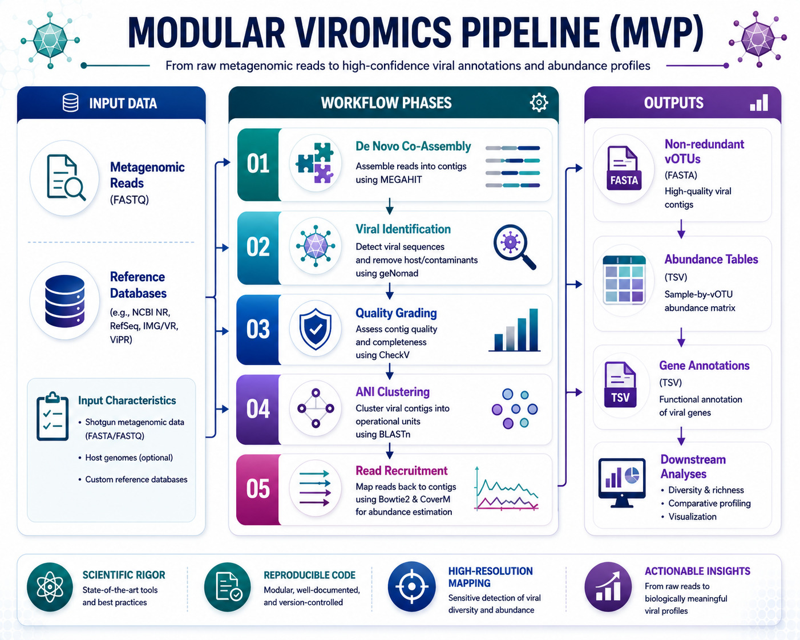

[](LICENSE)

# Comparative Neurodysbiosis Metagenomic and Viromics Pipeline



This repository implements a modular and reproducible bioinformatics pipeline designed for the extraction, quality assessment, clustering, and profiling of viral communities (the virome) from shotgun metagenomic datasets. The primary application of this workflow is the comparative analysis of gut viral populations associated with neurodevelopmental conditions, utilizing metagenomic datasets derived from gnotobiotic mouse models.

## Scientific Scope and Metagenomic Framework

Alterations in the gut microbiome have been linked to behavioral and physiological traits in neurodevelopmental conditions such as Autism Spectrum Disorder (ASD). This pipeline is built around the study design of Sharon et al. (2019), where germ-free mice were colonized with fecal microbiota from human donors diagnosed with ASD or typically developing (TD) controls.

To study the viral component of this system, the pipeline performs comparative viromics between two cohorts:
1. **Neurodysbiosis Cohort:** Gnotobiotic mice colonized with gut microbiota from ASD donors, corresponding to ENA accession ERR3144321.
2. **Neurotypical Control:** Gnotobiotic mice colonized with gut microbiota from TD donors, corresponding to ENA accession ERR3144319.

## Methodological Rigor and Quality Controls

Analyzing viral signals within complex metagenomes requires rigorous computational validation to prevent artifactual findings:

* **_De Novo_ Co-Assembly:** Standard metagenomic workflows can be biased by mapping reads to database references that may not be present in the sample. This pipeline uses MEGAHIT to construct a _de novo_ co-assembly from the raw sequencing reads. This approach allows the identification of native and novel viral contigs directly from the cohorts.
* **Validation of Read Recruitment:** To verify that the assembled viral contigs are biologically active in the samples, raw reads are mapped back to the assemblies. High mapping rates validate that the reconstructed viral genomes are representative of the physical community sequenced.
* **Non-Redundant Sequence Clustering:** Predicted viral sequences are clustered using BLASTn (95 percent average nucleotide identity over 85 percent alignment fraction) to collapse redundant sequences into stable viral operational taxonomic units (vOTUs).

## Pipeline Core Components

The Modular Viromics Pipeline (MVP) coordinates the execution of key bioinformatic tools across distinct modules:

* **Module 00 (Asset Validation):** Performs validation of input FASTQ files, structural directories, and cohort metadata maps.
* **Module 01 (Signature Extraction):** Annotates viral genes and taxonomically classifies contigs using geNomad, followed by completeness and quality grading using CheckV.
* **Module 02 (Quality Filtering):** Merges geNomad and CheckV outputs, filtering out low-confidence viral predictions or host contamination.
* **Module 03 (Sequence Clustering):** Collapses redundant viral sequences across samples into non-redundant vOTUs based on pairwise alignment parameters.
* **Module 04 (Abundance Mapping):** Indexes the non-redundant vOTUs with Bowtie2 and recruits raw cohort reads to estimate average coverage.
* **Module 05 (Abundance Profiling):** Integrates read recruitment metrics into final vOTU abundance tables using CoverM.
* **Module 06 (Functional Annotation):** Annotates viral genes against databases like PHROGs and Pfam to identify potential metabolic and structural functions.

## Repository Directory Structure

The structure of the repository is organized to separate code, databases, and cohort outputs:

```
comparative_neurodysbiosis_viromics_pipeline/
├── .gitignore                          # Excludes raw data while keeping directory structures
├── LICENSE                             # MIT License details
├── README.md                           # Documentation of the project
├── metadata.txt                        # Cohort mapping and file paths
├── envs/
│   └── mvp_env.yml                     # Conda environment specification file
├── scripts/
│   ├── 00_install.sh                   # Environment setup and database installation script
│   ├── 01_provision_data.sh            # ENA download and MEGAHIT co-assembly script
│   └── 02_execute_mvip.sh              # Orchestration script for modules 00 to 04
├── 00_READ_FILES/
│   └── README.md                       # Raw FASTQ files (ignored by Git)
├── 00_ASSEMBLY_FILES/
│   └── README.md                       # De novo assembled scaffolds (ignored by Git)
├── 00_MODIFIED_ASSEMBLY_FILES/
│   └── README.md                       # Renamed and filtered contigs (ignored by Git)
├── 00_DATABASES/
│   └── README.md                       # Local geNomad and CheckV databases (ignored by Git)
├── 01_GENOMAD/
│   └── README.md                       # geNomad prediction outputs (ignored by Git)
├── 02_CHECK_V/
│   └── README.md                       # CheckV quality reports (ignored by Git)
├── 03_CLUSTERING/
│   └── README.md                       # ANI-based vOTU clustering outputs (ignored by Git)
├── 04_READ_MAPPING/
│   └── README.md                       # Bowtie2 BAM files and CoverM coverage files (ignored by Git)
├── 05_VOTU_TABLES/
│   └── README.md                       # Abundance and horizontal coverage tables (ignored by Git)
└── 06_FUNCTIONAL_ANNOTATION/
    └── README.md                       # Functional annotation outputs (ignored by Git)
```

## Workflow Execution Instructions

Follow these steps to configure the environment and run the pipeline:

### 1. Provision the Environment and Reference Databases
Run the installation script to build the Conda environment and fetch the local databases:
```bash
./scripts/00_install.sh
```

### 2. Fetch Raw Reads and Perform _De Novo_ Co-Assembly
Download the cohort datasets and build the assembly:
```bash
./scripts/01_provision_data.sh
```

### 3. Execute the Core Pipeline
Activate the environment and execute the orchestration script:
```bash
conda activate mvip
./scripts/02_execute_mvip.sh
```

## References

1. Camargo, A. P., Roux, S., Schulz, F., Babinski, M., Xu, Y., Hu, B., Chain, P. S. G., Nayfach, S., & Kyrpides, N. C. (2024). Identification of mobile genetic elements with geNomad. *Nature Biotechnology*, 42(6), 841-845. https://doi.org/10.1038/s41587-023-01953-y

2. Nayfach, S., Camargo, A. P., Schulz, F., Roux, S., & Kyrpides, N. C. (2021). CheckV assesses the quality and completeness of metagenome-assembled viral genomes. *Nature Biotechnology*, 39(5), 578-585. https://doi.org/10.1038/s41587-020-00774-7

3. Li, D., Liu, C. M., Luo, R., Sadakane, K., & Lam, T. W. (2015). MEGAHIT: an ultra-fast single-node solution for large and complex metagenomics assembly via succinct de Bruijn graph. *Bioinformatics*, 31(10), 1674-1676. https://doi.org/10.1093/bioinformatics/btv033

4. Langmead, B., & Salzberg, S. L. (2012). Fast gapped-read alignment with Bowtie 2. *Nature Methods*, 9(4), 357-359. https://doi.org/10.1038/nmeth.1923

## License

This software is distributed under the terms of the MIT License. Refer to the [LICENSE](LICENSE) file for further details.

